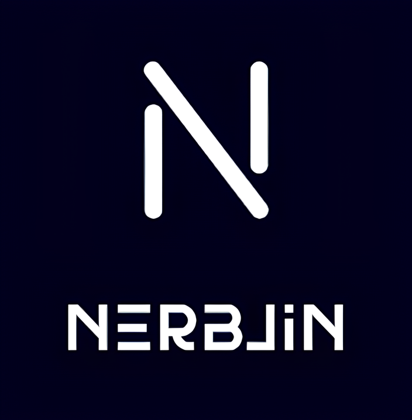
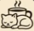
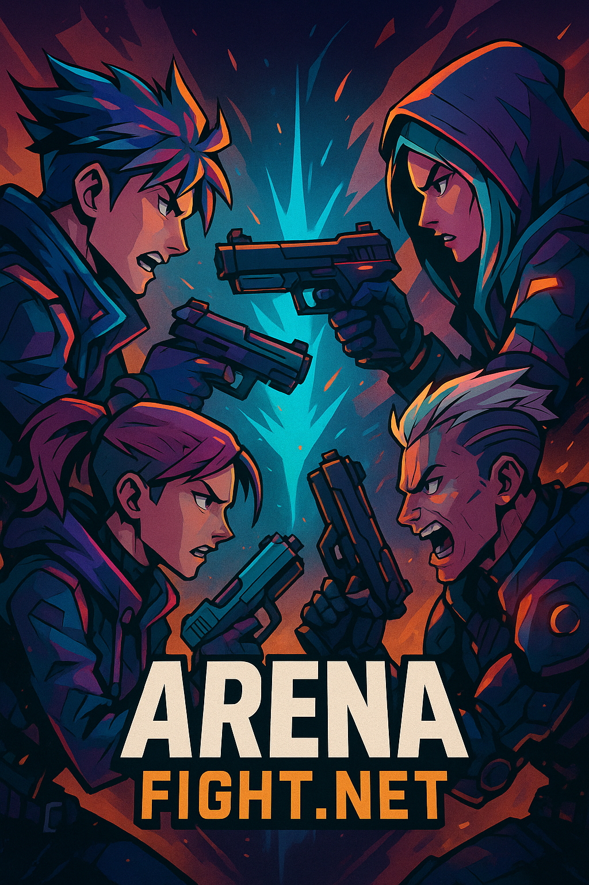
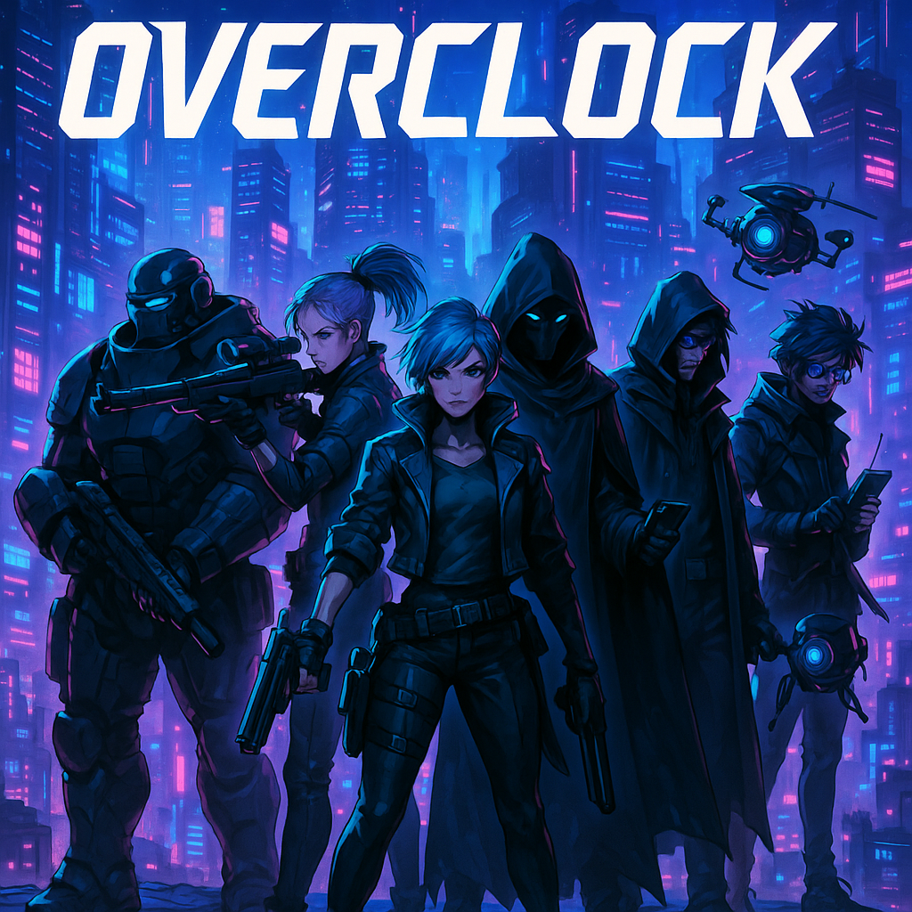

# Hi ! I'm.. 🙋‍♂️
### Indie Game Developer 🏎
### Game Server Programmer 💻
### SFX/BGM Designer 🎺

# Working.. 💪
 **Nerblin Studio** 
 **Coffee Nap Games**

# Worked.. 🦾
**🕶 SPADE ACE (2024)** 

# Activities & Awards 🏆
- Krafton Jungle Game Lab
- GDWC 2024 WINNER

 

# Projects in progress ⭕
### [Nerblin Studio] ***SHOWDOWN : ARENA (Turn-based Multiplayer)*** 
### [Coffee Nap Games] ***Overclock (Guild Management)***
 

# Completed projects ✔

# Primary programming language

# Available game programming engines

# Game Servers 

# ETC

<!--
**YoonHub/YoonHub** is a ✨ _special_ ✨ repository because its `README.md` (this file) appears on your GitHub profile.

Here are some ideas to get you started:

- 🔭 I’m currently working on ...
- 🌱 I’m currently learning ...
- 👯 I’m looking to collaborate on ...
- 🤔 I’m looking for help with ...
- 💬 Ask me about ...
- 📫 How to reach me: ...
- 😄 Pronouns: ...
- ⚡ Fun fact: ...
-->
