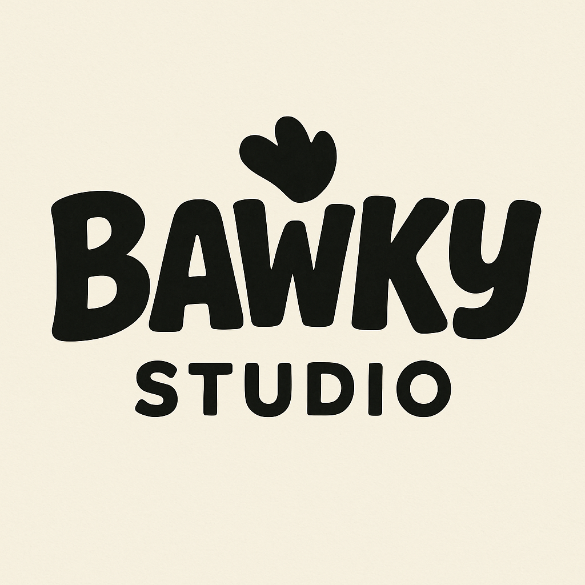
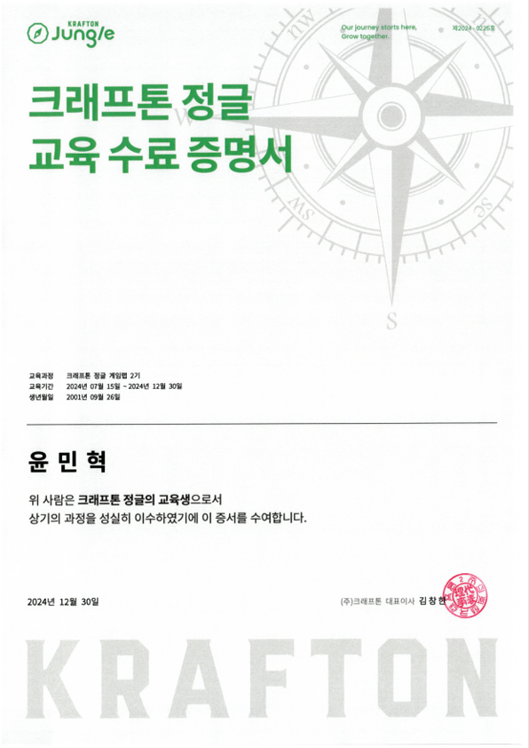
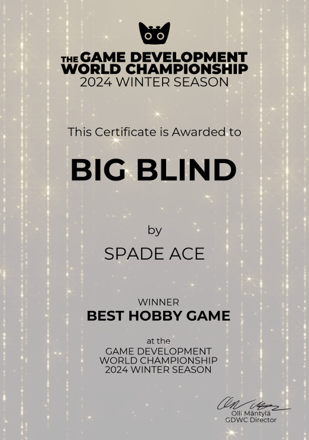
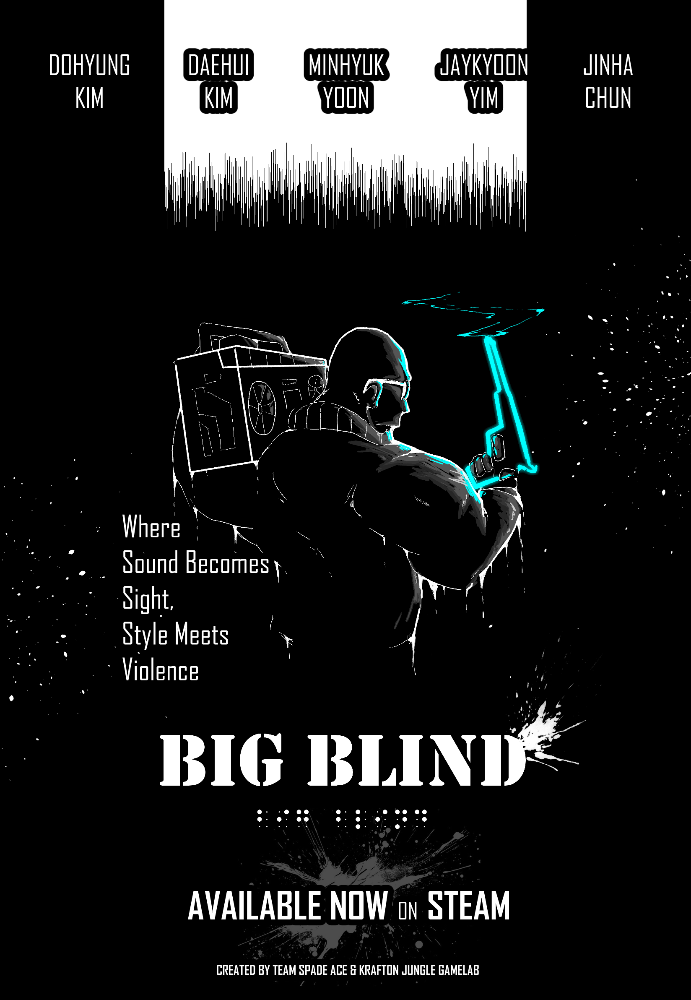

# Hi ! I'm.. 🙋‍♂️
### Indie Game Developer - [Unity / Unreal] 🏎
### Game Server Programmer - [P2P / Dedicated] 💻
### SFX/BGM Designer - [FL STUDIO 20] 🎺

# Working.. 💪
 **Bawky Studio** 

# Worked.. 🦾
**🕶 SPADE ACE (2024)** 

# Activities & Awards 🏆
- Krafton Jungle Game Lab
- Game Development World Championship GDWC 2024 WINNER

 

# Projects in progress ⭕
### [Bawky Studio] ***BETDOWN (Multiplayer Party Game)*** 

# Completed projects ✔

# Primary programming language

# Available game programming engines

# Game Servers 

# ETC

